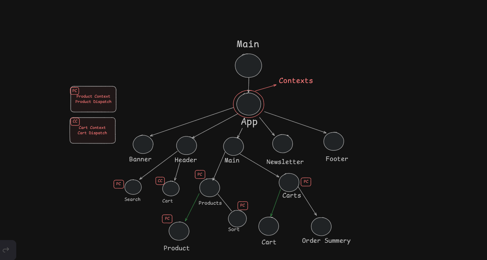

# LWS SHOP

---

## Overview

---

Clothes selling E-commerce single page web application build in React.js. This application has basic level user items management to advance search and sorting functionality.

---

## Some Features

- Adding and managing product into cart
- Coupons and checkout selected product
- Sorting products by ratings(popular), date, price (Bubble sort)
- Searching products by name (Linear Search)

---

## Project Diagram View

<div>

</div>

## ⚒️ Packages Installed

| Packages     | Version | Usage                         |
| ------------ | ------- | ----------------------------- |
| React JS     | ^19.0.0 | Using latest version of React |
| Tailwind CSS | ^4.0.0  | Adding faster styling         |

---

## 🧰 Installation

First, clone the repository by:

```bash
git clone https://github.com/jubayerahmed2/lws_shop
```

Second, checkout directory and Install the packages:

```bash
cd lws_shop
npm install
```

Finally, run the development server:

```bash
npm run dev
```
